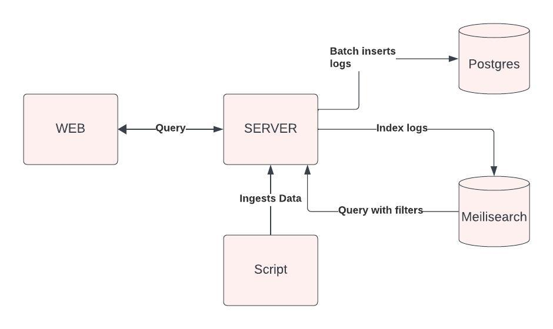

## Logswift

A logquery interface which can be used to ingest logs at `http://localhost:3000/` and query them at `http://localhost:3000/query`.


### Demo Video Link

<a href="https://www.loom.com/share/3e3eae3ac9b34e449218872c57256b17?sid=a39e1008-4901-4ab3-b860-2cf37631e901" target="_blank">Demo Video Link</a>

### Techstack used in this project

- NextJS and TailwindCSS - for the client helps in writing less css and faster development
- Golang - for the server which ingests the logs and from which the logs can be queried. Has good support for concurrency which helps in batching some operations.
- Postgres - for storing the logs mainly used as a persistene layer. If meilisearch loses the data, it can be recovered from the postgres database.
- Meilisearch - for indexing the logs and querying them faster. Gives ability for full text search, filtering and typo tolerance.

### Architecture and thought process for the solution

#### Diagram



- Ingestion Phase

  1. The logs are ingested in batches of 1000. This is done to reduce the number of insertion requests to postgres.
  2. The logs are stored in postgres as a backup in case meilisearch loses the data.
  3. The logs are ingested in meilisearch which helps in achieving faster query times, full text search, filtering and typo tolerance.

- Query Phase

  1. The logs are queried from meilisearch and the results are returned to the client.
  2. The tradeoff for better search query is that the indexing in meilisearch takes time hence it takes some to reflect the changes in the search results. Until around 50000-100000 the real time search is achieved.

- On Web
  1. Added a debounce of 500ms on the search input to reduce the number of requests to the server.

## Getting Started

To setup the project locally follow the below steps:

### Prerequisites

- Docker
- Docker-compose

If you want to make any change to the configuration, you can do so by changing the environment variables in the docker-compose file and for server you can update the config.yaml file in the server

### Installation

1. Clone the repo

   ```sh
   git clone https://github.com/dyte-submissions/november-2023-hiring-vsumit89
   ```

2. Run the docker-compose file
   ```sh
    docker-compose up
   ```
3. In case the client fails to start (I was facing issues while testing with docker-compose), you can run the client manually.

   ```sh
     cd web
     npm install
     npm run dev -- -p 3001
   ```

4. The client will be running at `http://localhost:3001` and the server will be running at `http://localhost:3000`

## Improvements (could not be done due to time constraints)

- Using Clickhouse instead of postgres for storing the logs. Clickhouse has better performance for batch insertion and better data compression.
- Adding unit, integration tests for the server
- Responsiveness of UI
- Using rabbitmq for queueing the logs and then ingesting them in batches in meilisearch
